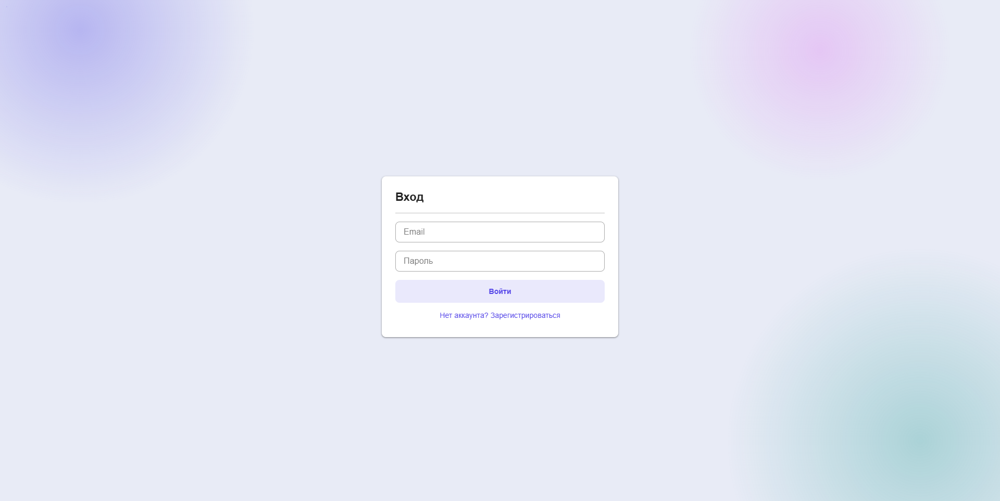
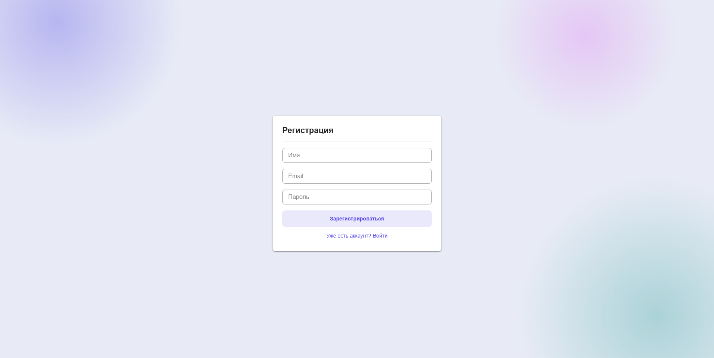
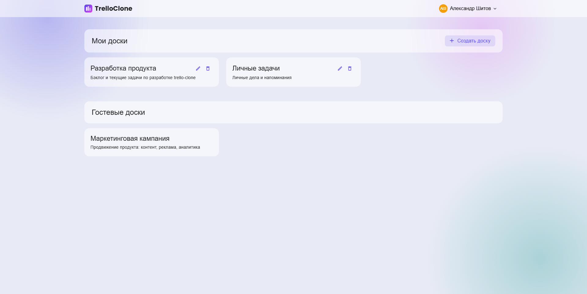
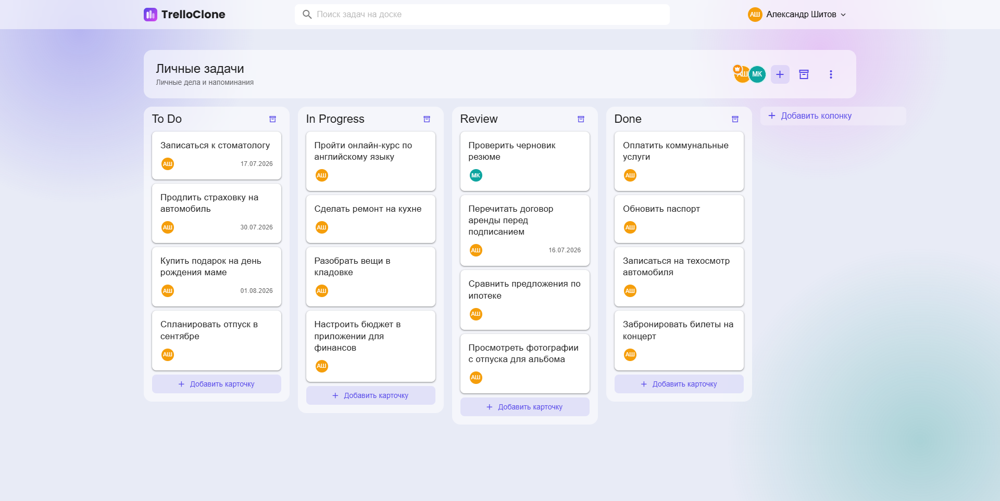
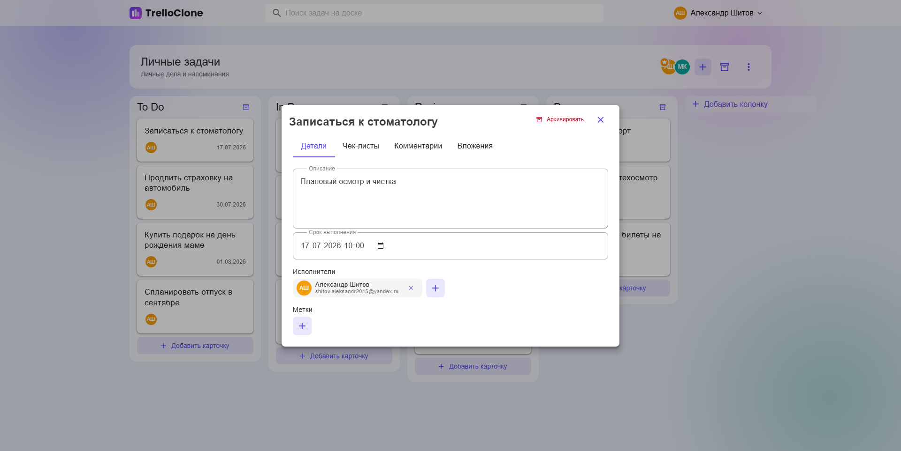
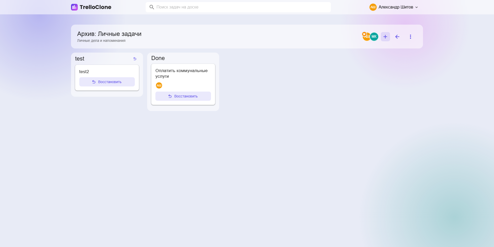
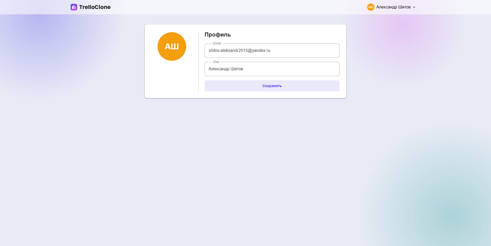

# Trello Clone — Frontend

Клон Trello: доски, колонки и карточки задач с drag-and-drop, поиском и архивом. Frontend-часть на Vue 3 + Vuetify, работающая поверх REST API.

## Возможности

- Регистрация и авторизация пользователей
- Создание и просмотр досок
- Колонки и карточки задач с drag-and-drop (vuedraggable)
- Поиск карточек внутри доски и глобальный поиск пользователей
- Архив досок
- Профиль пользователя

## Стек

- [Vue 3](https://vuejs.org/) + TypeScript
- [Vuetify](https://vuetifyjs.com/) — UI-компоненты
- [Pinia](https://pinia.vuejs.org/) — стейт-менеджмент
- [Vue Router](https://router.vuejs.org/)
- [Vuelidate](https://vuelidate-next.netlify.app/) — валидация форм
- [Axios](https://axios-http.com/) — HTTP-клиент
- [Vite](https://vitejs.dev/) — сборка

## Скриншоты

| Логин | Регистрация |
|---|---|
|  |  |

| Доски | Доска |
|---|---|
|  |  |

| Создание карточки | Архив досок |
|---|---|
|  |  |

| Профиль |
|---|
|  |

## Запуск

### Установка зависимостей

```bash
npm ci
```

### Переменные окружения

Скопируйте `.env.example` в `.env` и укажите адрес backend API:

```
VITE_API_BASE_URL=http://localhost:8080/api
```

### Разработка

```bash
npm run dev
```

### Сборка

```bash
npm run build
npm run preview
```

### Docker

```bash
docker build -t trello-clone-frontend .
docker run -p 80:80 trello-clone-frontend
```

## Полезные команды

- `npm run lint` / `npm run lint:fix` — проверка и автофикс ESLint
- `npm run type-check` — проверка типов TypeScript
- `npm run generate:api-types` — генерация типов из OpenAPI-схемы backend
